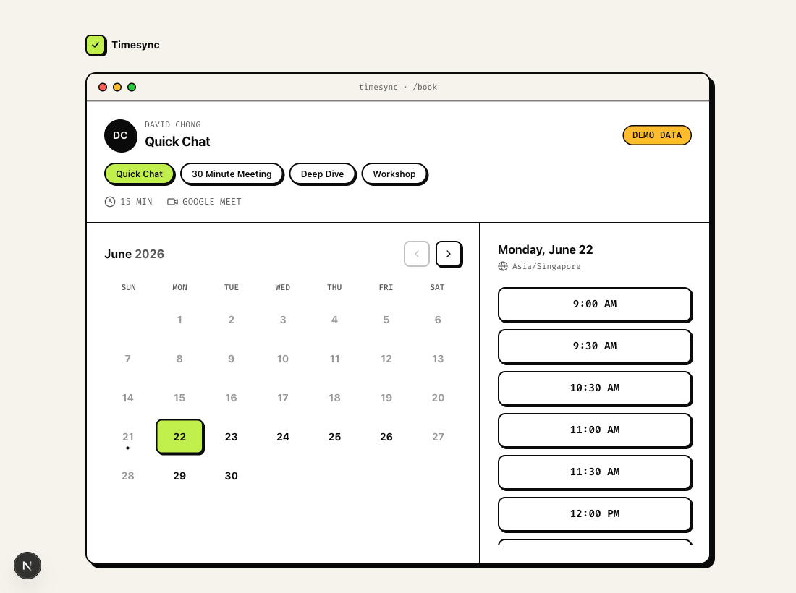

# Timesync


A Calendly-style scheduling tool wired to **Google Calendar**. Share a booking link, or drop a
one-line `<script>` into any of your apps to pop a booking **modal** — no redirect, no backend
work on the host app's side. Bookings create a real calendar event with a Google Meet link and
email both sides.

- 📆 **Real availability** — reads free/busy straight from Google Calendar
- 🪟 **Embeddable modal** — `Timesync.open()` from any origin, or a declarative `data-timesync` button
- 🎥 **Auto Meet links** — every booking creates an event + Google Meet invite
- 🌍 **Timezone-aware** — visitors see slots in their own timezone
- 🧪 **Demo mode** — runs with fabricated availability until you connect Google, so it's testable immediately
- 🗄️ **No database** — your calendar is the source of truth

<p align="center">
  
</p>

> The image above is a static screenshot — drop a short screen recording at `docs/demo.gif` to show the full booking flow in motion.

## Table of contents

- [Quick start](#quick-start)
- [Going live with Google Calendar](#going-live-with-google-calendar)
- [Availability config](#availability-config)
- [Embedding in another app](#embedding-in-another-app)
- [HTTP API](#http-api)
- [Deploy to Vercel](#deploy-to-vercel)
- [Troubleshooting](#troubleshooting)
- [Design system](#design-system)
- [Tech stack](#tech-stack)
- [Contributing](#contributing)
- [Code of Conduct](#code-of-conduct)
- [Roadmap](#roadmap)
- [Acknowledgements](#acknowledgements)
- [License](#license)

---

## Quick start

```bash
npm install
npm run dev
```

Open <http://localhost:3000>. With no Google credentials set, it runs in **demo mode** (fabricated
free/busy, fake Meet links) — the entire flow works so you can see and test it end to end.

Key routes:

| Route | What it is |
|-------|------------|
| `/` | Marketing landing page with a live preview + "Book a call" modal |
| `/book` | The booking widget (standalone). `?embed=1` renders the bare widget for iframes |
| `/embed-demo` | A mock "other app" embedding the modal, including the `onBooked` callback |
| `/setup` | One-time Google Calendar connection wizard |

---

## Going live with Google Calendar

1. In the [Google Cloud Console](https://console.cloud.google.com/apis/credentials), enable the
   **Google Calendar API** and create an **OAuth 2.0 Client ID** (type: *Web application*).
2. Add the redirect URI: `<your-origin>/api/auth/google/callback`
   (e.g. `http://localhost:3000/api/auth/google/callback`).
3. Copy `.env.example` → `.env.local` and fill in `GOOGLE_CLIENT_ID` and `GOOGLE_CLIENT_SECRET`.
4. Run the app, visit **`/setup`**, and click **Connect Google Calendar**.
   The resulting `GOOGLE_REFRESH_TOKEN` is written to `.env.local` (local dev) and printed to the
   server console. Restart the dev server — you're now live.

For production, copy that same `GOOGLE_REFRESH_TOKEN` into your host's environment variables.

### Environment variables

| Var | Required | Notes |
|-----|----------|-------|
| `GOOGLE_CLIENT_ID` / `GOOGLE_CLIENT_SECRET` | for live mode | OAuth client credentials |
| `GOOGLE_REFRESH_TOKEN` | for live mode | Minted via `/setup`. Its presence switches the app from demo → live |
| `GOOGLE_REDIRECT_URI` | optional | Defaults to `<origin>/api/auth/google/callback` |
| `OWNER_NAME` / `OWNER_EMAIL` | optional | Shown in the widget / used as the event organizer |
| `TIMESYNC_TZ` | optional | IANA zone for your availability (default `Asia/Singapore`) |
| `NEXT_PUBLIC_TIMESYNC_URL` | optional | Public base URL for OG tags + the embed snippet |

---

## Availability config

Edit [`lib/config.ts`](./lib/config.ts):

- `weeklyHours` — working windows per weekday (`0`=Sun … `6`=Sat). Omit a day to make it unavailable.
- `eventTypes` — the bookable meeting types (id, label, duration, description).
- `slotInterval`, `minNoticeMinutes`, `maxAdvanceDays`, `bufferMinutes`.

---

## Embedding in another app

Include the script once, then either use a declarative button **or** call the API:

```html
<script src="https://your-timesync.app/embed.js"></script>

<!-- Declarative -->
<button data-timesync data-event-type="30min">Book a call</button>

<!-- Programmatic -->
<button onclick="Timesync.open({ eventType: '30min' })">Book a call</button>
```

**`Timesync.open(opts)`** options: `eventType`, `name`, `email` (prefill), `color` (hex, themes the
widget), `url` (point at a specific Timesync instance), `onBooked` (callback).

Listen for completed bookings from anywhere:

```js
window.addEventListener("message", (e) => {
  if (e.data?.type === "timesync:booked") console.log("Booked!", e.data.payload);
});
```

The modal loads `/book?embed=1` in an iframe (so it works cross-origin with no CORS setup) and is
dismissible via the close button, backdrop click, or `Esc`.

---

## HTTP API

All endpoints return JSON and send permissive CORS headers, so you can build a fully custom UI.

- `GET /api/config` → owner, timezone, event types, mode (`live`/`demo`).
- `GET /api/availability?date=YYYY-MM-DD&eventType=30min` → `{ slots: [{ start, end }] }` (UTC ISO).
- `POST /api/book` → `{ eventTypeId, start, name, email, notes }` → creates the event.
  Re-validates the slot server-side and returns `409` if it was just taken.

When the owner's Google refresh token has expired or been revoked, `/api/availability` and
`/api/book` return **`503`** with `{ "error": "...", "code": "reauth_required" }` (never an
unhandled `500`). The widget surfaces this as a *"Calendar temporarily unavailable"* message.
See [Troubleshooting](#troubleshooting).

---

## Deploy to Vercel

1. Import the repo, set the env vars above (including `GOOGLE_REFRESH_TOKEN`).
2. Update your Google OAuth redirect URI to the production
   `https://<your-domain>/api/auth/google/callback`.
3. Deploy. The favicon (`app/icon.svg`) is included.

---

## Troubleshooting

### Bookings fail with "Calendar temporarily unavailable" / re-authenticate

Google refresh tokens can stop working — most commonly with an `invalid_grant` error. This happens
when the token is revoked (owner removed the app under [Google Account → Security → Third-party
access](https://myaccount.google.com/connections)), the password is changed, the token sits unused
past its expiry, or a project still in **Testing** mode expires the token after 7 days.

When this happens the calendar APIs return a typed **`503 { code: "reauth_required" }`** (not a
generic `500`), and the booking widget shows *"Calendar temporarily unavailable — the owner needs to
re-authenticate."*

**Fix — mint a fresh refresh token:**

1. Visit **`/setup`** on your deployment and click **Connect Google Calendar** (re-runs the OAuth
   consent flow). This mints a new `GOOGLE_REFRESH_TOKEN`.
2. Update `GOOGLE_REFRESH_TOKEN` in your host's environment variables (locally it's rewritten into
   `.env.local`).
3. Redeploy / restart the server so the new token is picked up.

To avoid the recurring 7-day expiry, move your Google Cloud OAuth consent screen from **Testing** to
**In production** (publishing status), so refresh tokens no longer auto-expire.

---

## Design system

The UI is built with **clico-ds** — a playful neo-brutalist design system (cream paper, 2px ink
borders + hard offset shadows, pill CTAs, lime accent, Instrument Sans/Serif + JetBrains Mono),
vendored into this repo at [`vendor/clico-ds`](vendor/clico-ds) so the app is self-contained:

```bash
# already wired in package.json + .npmrc (install-links=true)
npm install
```

`app/layout.tsx` imports `clico-ds/styles.css` (tokens + fonts + component CSS); the booking widget,
landing page, and host-demo compose `Button`, `Panel`, `Badge`, `BrowserFrame`, `FeatureCard`,
`DisplayHeading`/`SerifAccent`, and `WindowDots`, with bespoke parts (calendar, slots) styled from
the `--clico-*` tokens. The embed accent is the `--clico-lime` token, overridable per-embed via the
`color` option.

> **Note:** clico-ds is a `file:vendor/clico-ds` dependency. `.npmrc` sets `install-links=true` so
> it's copied into `node_modules` (not symlinked), which Turbopack needs to resolve it.

## Tech stack

Next.js 16 (App Router, Turbopack) · React 19 · Tailwind v4 · clico-ds (Instrument Sans/Serif +
JetBrains Mono) · Framer Motion · `googleapis` · TypeScript. No database.

---

## Contributing

Contributions are welcome! Please open an issue first to discuss what you'd like to change.

1. Fork the repo
2. Create a feature branch (`git checkout -b feature/your-feature`)
3. Commit your changes (`git commit -m 'feat: describe change'`)
4. Push and open a pull request

Please make sure `npm run lint`, `npm test`, and `npm run build` all pass before submitting a PR.

## Code of Conduct

This project follows the [Contributor Covenant v2.1](https://www.contributor-covenant.org/version/2/1/code_of_conduct/).
By participating you agree to uphold a welcoming, harassment-free environment.

## Roadmap

- [ ] Recurring/blackout availability rules
- [ ] Booker-timezone day grouping (currently slots are grouped by the owner's local date)
- [ ] Reschedule & cancel links in the confirmation email
- [ ] Multiple hosts / round-robin scheduling
- [ ] Optional persistence (e.g. Supabase) for multi-owner setups

## Acknowledgements

- UI built with clico-ds — a neo-brutalist React design system (vendored in `vendor/clico-ds`)
- Calendar integration via [`googleapis`](https://github.com/googleapis/google-api-nodejs-client)
- Bootstrapped with [Next.js](https://nextjs.org)

## License

Distributed under the MIT License. See [LICENSE](LICENSE) for details.
